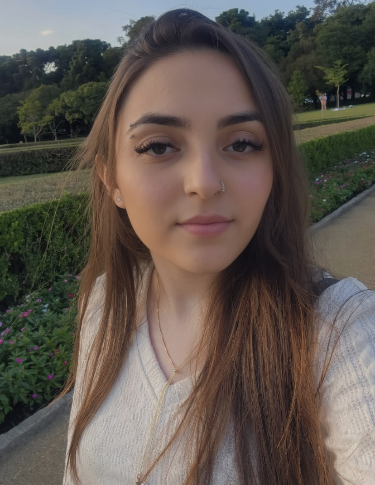

<h1 align="center">Portfólio</h1>

Olá! me chamo Ana Laura Moratelli, tenho 18 anos, sou estudante de desenvolvimento de software multiplataforma.
Esse é meu portfólio onde apresenta as informações dos meus projetos e dos quais pretendo desenvolver.

 

<h2>Tecnologias que pretendo utilizar:</h2>

<h2>Como clonar para executar o projeto?</h2> 
Digite esse comando no prompt de comando do seu computador:

        git clone https://github.com/Ana-Laura-Moratelli/portfolio_digital_dsm.git

(Validação professor FGMC - 1DSM - 2023-02)
